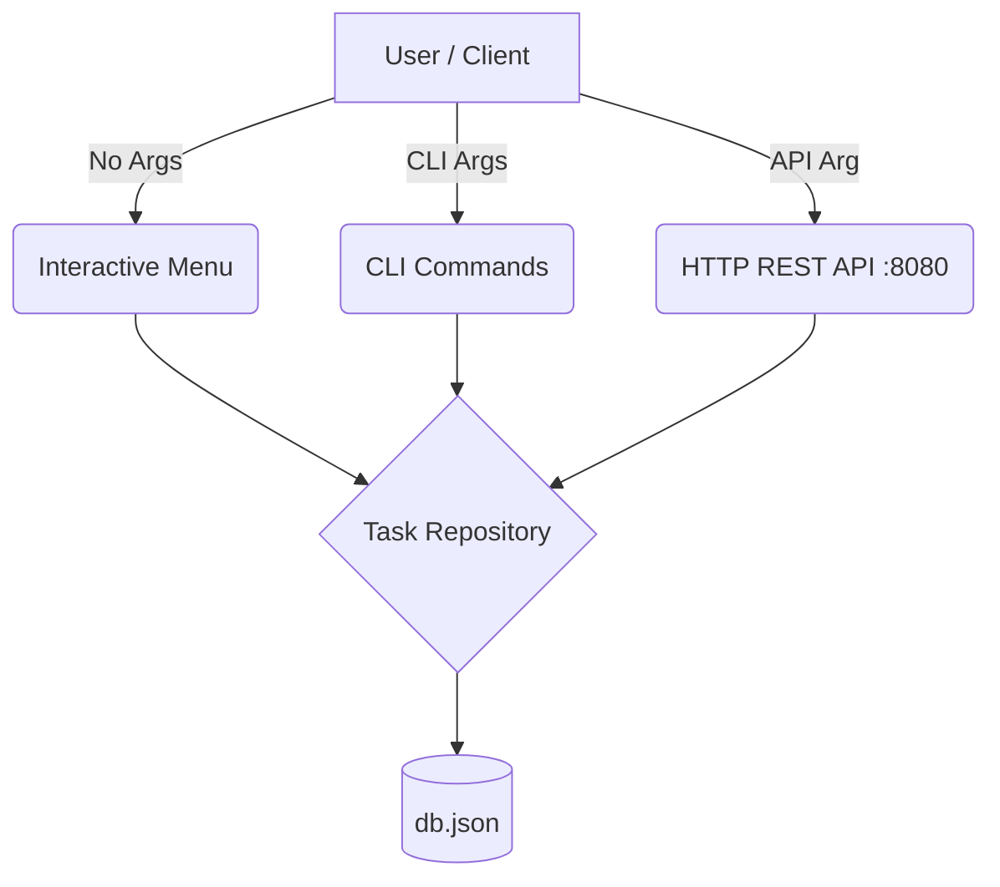

# 📝 Go Task Manager CLI

> **Manage your tasks directly from the terminal with ease and speed.**


## 📖 About The Project

**Go Task Manager CLI** is a lightweight, zero-dependency task management tool built entirely in Go. It solves the problem of context switching for developers by allowing them to manage their daily tasks directly from the terminal without breaking their workflow.

Whether you prefer a guided interactive menu, quick one-liner CLI commands, or exposing your tasks via an HTTP API, this tool has you covered. Data is persisted locally in a simple JSON file, making it highly portable, fast, and easy to back up.

### ✨ Key Features
*   **Interactive Mode:** A user-friendly, prompt-based menu for seamless task management.
*   **Direct CLI Commands:** Quick one-liners to add, list, and complete tasks instantly.
*   **Built-in HTTP API:** Expose your tasks over a local REST API for integration with other systems.
*   **Local Storage:** Zero database setup required; data is safely stored in a local `db.json` file.

### 🏛️ Architecture Flow


## 🛠️ Tech Stack

*   **Language:** Go (Golang) 🐹
*   **Database:** Local JSON File (`db.json`) 📄
*   **Libraries:** Go Standard Library (`net/http`, `os`, `encoding/json`, `bufio`) 📦

## 🚀 Getting Started

Follow these steps to get a local copy up and running.

### Prerequisites
*   [Go](https://go.dev/doc/install) (Version 1.26.4 or higher recommended)

### Installation

1.  **Clone the repository:**
    ```bash
    git clone https://github.com/yourusername/go-task-manager-cli.git
    cd go-task-manager-cli
    ```

2.  **Build the executable:**
    ```bash
    go build -o todo-cli
    ```
    *(Note: No external dependencies need to be installed as the project relies solely on the standard library.)*

## 💻 Usage

You can use the application in three different modes.

### 1. Interactive Mode
Run the executable without any arguments to launch the interactive menu:
```bash
./todo-cli
```

### 2. CLI Mode
Pass arguments directly to execute actions immediately without entering the menu:

*   **Add a task:**
    ```bash
    ./todo-cli add "Review PRs"
    ```
*   **List all tasks:**
    ```bash
    ./todo-cli list
    ```
*   **Mark a task as done:**
    ```bash
    ./todo-cli done 1
    ```
*   **Show help menu:**
    ```bash
    ./todo-cli help
    ```

### 3. API Mode
Start the built-in HTTP server on port `8080`:
```bash
./todo-cli api
```

**API Examples:**

*   *Create a task (Request):*
    ```bash
    curl -X POST http://localhost:8080/task \
         -H "Content-Type: application/json" \
         -d '{"description": "Write documentation"}'
    ```

*   *List tasks (Response):*
    ```bash
    curl http://localhost:8080/task
    ```
    ```json
    [
      {
        "ID": 1,
        "Description": "Write documentation",
        "IsDone": false
      }
    ]
    ```

*   *Mark task as done:*
    ```bash
    curl -X PATCH http://localhost:8080/task/1/done
    ```

## 📂 Project Structure

```text
.
├── main.go               # Entry point and argument parsing
├── cli.go                # Direct CLI commands logic (add, list, done, help)
├── interactive-menu.go   # REPL interactive menu implementation
├── api.go                # HTTP REST API server and routing
├── database.go           # File I/O operations for db.json
├── task.repository.go    # Data manipulation and array queries
├── create-task.dto.go    # Data Transfer Object for API POST requests
├── db.json               # Auto-generated local database file
└── go.mod                # Go module definitions
```

## 🗺️ Roadmap / To-Do

Based on the current codebase, here are planned future improvements:
1.  **Implement Task Editing:** The `updateTaskOnDatabase` function is currently commented out in `task.repository.go`. Re-enabling and wiring this feature will allow updating existing task descriptions.
2.  **Add Delete Functionality:** Introduce a CLI command and API endpoint to permanently remove tasks from the `db.json` database to keep the list clean.
3.  **Implement Unit Testing:** Add `_test.go` files for core repository and database logic to ensure reliability and prevent regressions.
